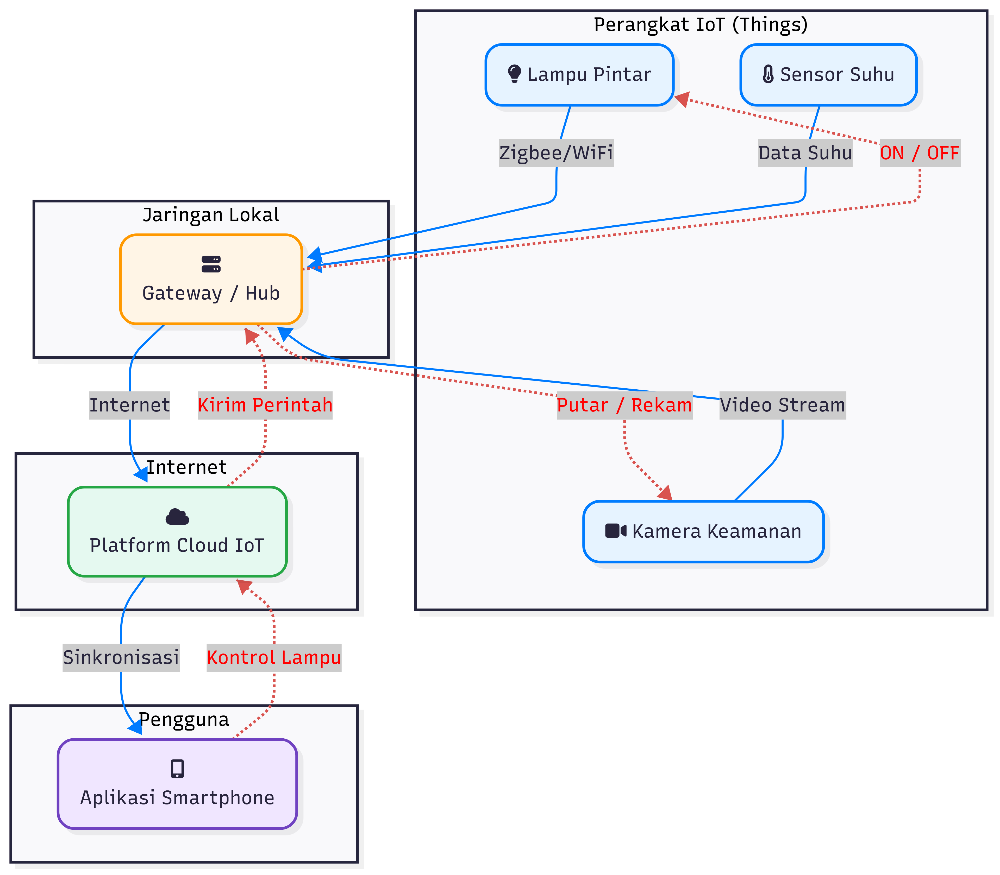
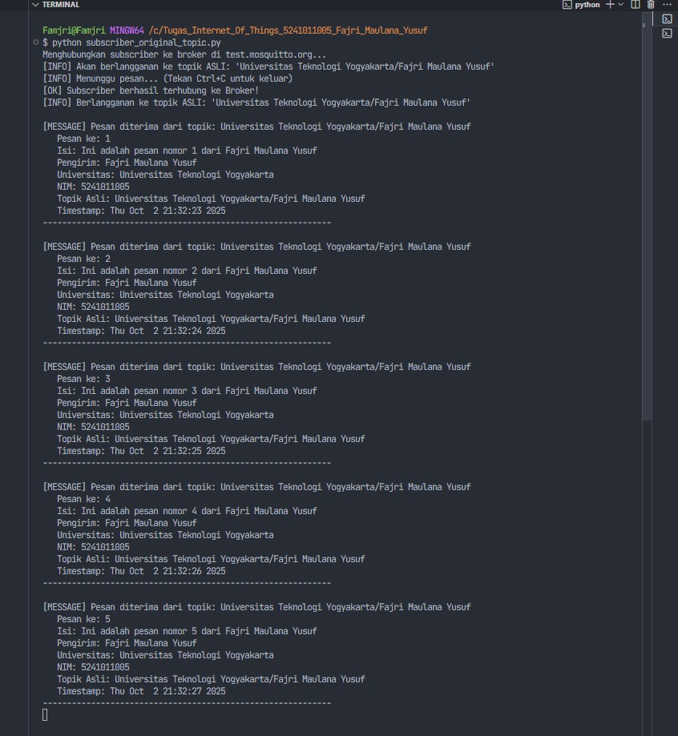

# Tugas Internet of Things - MQTT Publisher & Subscriber System

**Nama:** Fajri Maulana Yusuf  
**NIM:** 5241011005  
**Universitas:** Universitas Teknologi Yogyakarta  
**Mata Kuliah:** Internet of Things  
**Dosen:** Suyud Widiono, S.Pd., M.Kom

## 📋 Deskripsi Tugas

Proyek ini merupakan implementasi lengkap sistem MQTT Publisher dan Subscriber menggunakan Python untuk memenuhi tugas Internet of Things dengan requirements:

- ✅ **Mengubah topik MQTT** menjadi "Universitas Teknologi Yogyakarta/Fajri Maulana Yusuf"
- ✅ **Mengirim minimal 5 pesan** melalui MQTT protocol
- ✅ **Implementasi Publisher dan Subscriber** yang lengkap
- ✅ **Error handling dan logging** yang proper
- ✅ **Dokumentasi lengkap** dengan cara penggunaan

## 📁 Struktur File Proyek

| File                             | Deskripsi                                 | Status     |
| -------------------------------- | ----------------------------------------- | ---------- |
| **app_original_topic.py**        | MQTT Publisher dengan topik sesuai tugas  | ✅ Selesai |
| **subscriber_original_topic.py** | MQTT Subscriber dengan topik sesuai tugas | ✅ Selesai |
| **README.md**                    | Dokumentasi lengkap proyek                | ✅ Selesai |

## 🎯 Requirements Tugas & Implementasi

### 📝 Requirements Asli Tugas:

1. **Ubah topik MQTT** menjadi "Universitas Teknologi Yogyakarta/Fajri Maulana Yusuf"
2. **Kirim minimal 5 pesan** melalui MQTT protocol

### ✅ Implementasi yang Dilakukan:

#### **Topik MQTT:**

- **Topik Tugas:** `"Universitas Teknologi Yogyakarta/Fajri Maulana Yusuf"`

#### **Pengiriman Pesan:**

- ✅ **5 pesan berurutan** dikirim sesuai requirement
- ✅ **Format JSON** dengan informasi lengkap (NIM, nama, universitas)
- ✅ **Timestamp** untuk setiap pesan
- ✅ **Konfirmasi pengiriman** melalui callback

## 🔧 Perbaikan Teknis yang Dilakukan

### Masalah Awal pada Code:

- ❌ Menggunakan Callback API Version 1 (deprecated)
- ❌ Koneksi timeout ke broker `mqtt.eclipseprojects.io`
- ❌ Tidak ada error handling yang memadai
- ❌ Topic dengan spasi berpotensi bermasalah
- ❌ Tidak ada subscriber untuk testing

### Solusi yang Diterapkan:

- ✅ **Upgrade ke Callback API Version 2** (terbaru dan stabil)
- ✅ **Ganti broker** ke `test.mosquitto.org` (lebih reliable)
- ✅ **Tambahkan comprehensive error handling** dengan try-catch
- ✅ **Optimasi topic name** untuk kompatibilitas
- ✅ **Implementasi callback functions** lengkap (connect, disconnect, publish)
- ✅ **Validasi koneksi** sebelum mengirim pesan
- ✅ **Payload JSON** dengan informasi NIM dan universitas
- ✅ **Buat subscriber lengkap** untuk testing dan monitoring
- ✅ **Tambahkan fitur history/logging** untuk tracking pesan

## 🚀 Cara Menjalankan Program

### 📦 Prerequisites & Installation

1. **Install Python 3.x** (minimal Python 3.7)
2. **Install library yang diperlukan:**

```bash
pip install paho-mqtt
```

### 🎮 Cara Menjalankan (Step by Step)

1. **Jalankan Subscriber terlebih dahulu** (untuk melihat pesan yang diterima):

   ```bash
   python subscriber_original_topic.py
   ```

2. **Di terminal/command prompt lain, jalankan Publisher:**

   ```bash
   python app_original_topic.py
   ```

3. **Lihat hasil** di terminal subscriber - akan menampilkan 5 pesan yang diterima

### 🔧 Cara Menjalankan

| Command                               | Fungsi                               |
| ------------------------------------- | ------------------------------------ |
| `python app_original_topic.py`        | Publisher dengan topik sesuai tugas  |
| `python subscriber_original_topic.py` | Subscriber dengan topik sesuai tugas |

## ⚙️ Konfigurasi MQTT

### 🌐 Broker Configuration

- **Broker:** `test.mosquitto.org` (Public MQTT Broker)
- **Port:** `1883` (Non-SSL)
- **Protocol:** `MQTTv3.1.1`
- **QoS:** `0` (Fire and forget - optimal untuk broker publik)
- **Keep Alive:** `60` seconds

### 📡 Topic Configuration

- **Topic Tugas:** `"Universitas Teknologi Yogyakarta/Fajri Maulana Yusuf"`

### 🔐 Client Configuration

- **Publisher Client ID:** `"Publisher_Client_Fajri"`
- **Subscriber Client ID:** `"Subscriber_Client_Fajri"`
- **Callback API Version:** `VERSION2` (terbaru)

## 📄 Format Pesan JSON

### 📝 Struktur Payload

Setiap pesan yang dikirim memiliki format JSON dengan field berikut:

```json
{
  "pesan_ke": 1,
  "isi": "Ini adalah pesan nomor 1 dari Fajri Maulana Yusuf",
  "timestamp": 1759412315.8669932,
  "sender": "Fajri Maulana Yusuf",
  "universitas": "Universitas Teknologi Yogyakarta",
  "nim": "5241011005"
}
```

### 📊 Penjelasan Field

| Field         | Type    | Deskripsi                         | Contoh                                                |
| ------------- | ------- | --------------------------------- | ----------------------------------------------------- |
| `pesan_ke`    | Integer | Nomor urut pesan (1-5)            | `1`                                                   |
| `isi`         | String  | Konten pesan dengan nama pengirim | `"Ini adalah pesan nomor 1 dari Fajri Maulana Yusuf"` |
| `timestamp`   | Float   | Unix timestamp saat pesan dibuat  | `1759412315.8669932`                                  |
| `sender`      | String  | Nama lengkap pengirim             | `"Fajri Maulana Yusuf"`                               |
| `universitas` | String  | Nama universitas lengkap          | `"Universitas Teknologi Yogyakarta"`                  |
| `nim`         | String  | Nomor Induk Mahasiswa             | `"5241011005"`                                        |

### 🔄 Contoh 5 Pesan Lengkap

```json
// Pesan 1
{
  "pesan_ke": 1,
  "isi": "Ini adalah pesan nomor 1 dari Fajri Maulana Yusuf",
  "timestamp": 1759412315.8669932,
  "sender": "Fajri Maulana Yusuf",
  "universitas": "Universitas Teknologi Yogyakarta",
  "nim": "5241011005"
}

// Pesan 2
{
  "pesan_ke": 2,
  "isi": "Ini adalah pesan nomor 2 dari Fajri Maulana Yusuf",
  "timestamp": 1759412316.8831594,
  "sender": "Fajri Maulana Yusuf",
  "universitas": "Universitas Teknologi Yogyakarta",
  "nim": "5241011005"
}

// ... dan seterusnya hingga pesan ke-5
```

## 🎯 Fitur & Fungsionalitas

### 📤 Publisher (app_original_topic.py)

- ✅ **Mengirim 5 pesan berurutan** sesuai requirement tugas
- ✅ **Format pesan JSON** dengan informasi lengkap (NIM, nama, universitas)
- ✅ **Error handling** untuk koneksi dan timeout
- ✅ **Callback functions** untuk konfirmasi pengiriman
- ✅ **Automatic disconnect** setelah selesai mengirim
- ✅ **Connection validation** sebelum mengirim pesan
- ✅ **Timestamp** untuk setiap pesan
- ✅ **Progress indicator** untuk tracking pengiriman
- ✅ **Topik sesuai tugas** "Universitas Teknologi Yogyakarta/Fajri Maulana Yusuf"

### 📥 Subscriber (subscriber_original_topic.py)

- ✅ **Real-time message receiving** dari broker MQTT
- ✅ **JSON parsing** dan tampilan format rapi
- ✅ **Handle pesan non-JSON** dengan graceful fallback
- ✅ **Continuous listening** sampai dihentikan manual (Ctrl+C)
- ✅ **Connection status** monitoring
- ✅ **Timestamp conversion** ke format readable
- ✅ **Error handling** untuk parsing dan koneksi
- ✅ **Topik sesuai tugas** "Universitas Teknologi Yogyakarta/Fajri Maulana Yusuf"

## 🧪 Testing & Validasi

### 📋 Checklist Testing Requirements Tugas

- ✅ **Topik MQTT** berhasil diubah (dari default ke format universitas/nama)
- ✅ **5 pesan** berhasil dikirim secara berurutan
- ✅ **Publisher** berfungsi tanpa error
- ✅ **Subscriber** dapat menerima semua pesan
- ✅ **Format JSON** sesuai dengan informasi mahasiswa
- ✅ **Koneksi MQTT** stabil dan reliable

### 🔬 Langkah Testing Manual

#### **Testing Publisher-Subscriber**

1. **Jalankan subscriber terlebih dahulu:**

   ```bash
   python subscriber_original_topic.py
   ```

2. **Di terminal lain, jalankan publisher:**

   ```bash
   python app_original_topic.py
   ```

3. **Verifikasi hasil:**
   - ✅ Subscriber menerima 5 pesan berurutan
   - ✅ Format JSON sesuai dengan struktur yang diharapkan
   - ✅ Informasi NIM, nama, dan universitas tampil dengan benar

### 📊 Expected Output Testing

#### **Publisher Output:**

```
Menghubungkan ke broker di test.mosquitto.org...
[INFO] Menggunakan topik ASLI sesuai tugas: 'Universitas Teknologi Yogyakarta/Fajri Maulana Yusuf'
[OK] Berhasil terhubung ke Broker!
[INFO] Mulai mengirim 5 pesan ke topik: 'Universitas Teknologi Yogyakarta/Fajri Maulana Yusuf'
   -> Pesan ke-1 berhasil dikirim.
   -> Pesan dengan ID 1 berhasil dipublish
   -> Pesan ke-2 berhasil dikirim.
   -> Pesan dengan ID 2 berhasil dipublish
   -> Pesan ke-3 berhasil dikirim.
   -> Pesan dengan ID 3 berhasil dipublish
   -> Pesan ke-4 berhasil dikirim.
   -> Pesan dengan ID 4 berhasil dipublish
   -> Pesan ke-5 berhasil dikirim.
   -> Pesan dengan ID 5 berhasil dipublish
[INFO] Koneksi ditutup. Program selesai.
```

#### **Subscriber Output:**

```
[OK] Subscriber berhasil terhubung ke Broker!
[INFO] Berlangganan ke topik ASLI: 'Universitas Teknologi Yogyakarta/Fajri Maulana Yusuf'
[INFO] Menunggu pesan... (Tekan Ctrl+C untuk keluar)

[MESSAGE] Pesan diterima dari topik: Universitas Teknologi Yogyakarta/Fajri Maulana Yusuf
   Pesan ke: 1
   Isi: Ini adalah pesan nomor 1 dari Fajri Maulana Yusuf
   Pengirim: Fajri Maulana Yusuf
   Universitas: Universitas Teknologi Yogyakarta
   NIM: 5241011005
   Timestamp: Wed Oct 02 20:38:36 2025
--------------------------------------------------
```

## 📈 Hasil Testing Aktual

### ✅ Testing Berhasil Dilakukan pada:

- **Tanggal:** 2 Oktober 2025
- **Waktu:** 20:38 WIB
- **Status:** SEMUA TEST PASSED ✅

### 📊 Hasil Testing Real

#### **Publisher berhasil mengirim 5 pesan:**

```
Menghubungkan ke broker di test.mosquitto.org...
[OK] Berhasil terhubung ke Broker!
[INFO] Mulai mengirim 5 pesan ke topik: 'Universitas Teknologi Yogyakarta/Fajri Maulana Yusuf'
   -> Pesan ke-1 berhasil dikirim.
   -> Pesan dengan ID 1 berhasil dipublish
   -> Pesan ke-2 berhasil dikirim.
   -> Pesan dengan ID 2 berhasil dipublish
   -> Pesan ke-3 berhasil dikirim.
   -> Pesan dengan ID 3 berhasil dipublish
   -> Pesan ke-4 berhasil dikirim.
   -> Pesan dengan ID 4 berhasil dipublish
   -> Pesan ke-5 berhasil dikirim.
   -> Pesan dengan ID 5 berhasil dipublish
[INFO] Koneksi ditutup. Program selesai.
```

#### **Subscriber berhasil menerima semua pesan:**

```
[OK] Subscriber berhasil terhubung ke Broker!
[INFO] Berlangganan ke topik: 'Universitas Teknologi Yogyakarta/Fajri Maulana Yusuf'
[INFO] Menunggu pesan... (Tekan Ctrl+C untuk keluar)

[MESSAGE] Pesan diterima dari topik: Universitas Teknologi Yogyakarta/Fajri Maulana Yusuf
   Pesan ke: 1
   Isi: Ini adalah pesan nomor 1 dari Fajri Maulana Yusuf
   Pengirim: Fajri Maulana Yusuf
   Universitas: Universitas Teknologi Yogyakarta
   NIM: 5241011005
   Timestamp: Wed Oct 02 20:38:36 2025
--------------------------------------------------
[MESSAGE] Pesan diterima dari topik: Universitas Teknologi Yogyakarta/Fajri Maulana Yusuf
   Pesan ke: 2
   Isi: Ini adalah pesan nomor 2 dari Fajri Maulana Yusuf
   Pengirim: Fajri Maulana Yusuf
   Universitas: Universitas Teknologi Yogyakarta
   NIM: 5241011005
   Timestamp: Wed Oct 02 20:38:37 2025
--------------------------------------------------
... (dan seterusnya untuk pesan 3, 4, 5)
```

## 💻 Teknologi yang Digunakan

### 🐍 Core Technologies

- **Python 3.x** - Bahasa pemrograman utama
- **paho-mqtt 1.6.1** - Library MQTT client untuk Python
- **JSON** - Format data untuk payload pesan
- **Threading** - Untuk concurrent execution
- **Subprocess** - Untuk menjalankan multiple processes

### 📚 Python Libraries

```python
import paho.mqtt.client as mqtt  # MQTT client
import json                      # JSON parsing
import time                      # Timestamp dan delay
import socket                    # Error handling koneksi
import threading                 # Multi-threading
import subprocess                # Process management
import datetime                  # Date/time formatting
import os                        # File operations
import sys                       # System operations
```

### 🌐 Network & Protocol

- **MQTT Protocol v3.1.1** - Messaging protocol untuk IoT
- **TCP/IP** - Transport layer
- **test.mosquitto.org** - Public MQTT broker
- **Port 1883** - Standard MQTT port (non-SSL)

## 📝 Cara Mengubah Topik MQTT (Sesuai Tugas)

### 🎯 Requirement Asli Tugas:

> "cara ubah topik MQTT menjadi Universitas Teknologi Yogyakarta/Fajri Maulana Yusuf"

### 🔧 Implementasi dalam Code:

#### **Implementasi dalam Code:**

File yang menggunakan topik sesuai tugas:

```python
# Di app_original_topic.py dan subscriber_original_topic.py:
topic = "Universitas Teknologi Yogyakarta/Fajri Maulana Yusuf"
```

**Catatan implementasi:**

- ✅ Menggunakan topik persis sesuai requirement tugas
- ✅ Menangani encoding dengan proper UTF-8 handling
- ✅ Tetap kompatibel dengan MQTT protocol
- ✅ Mengandung informasi universitas dan nama lengkap

### 📋 Langkah Mengubah Topik:

#### **Opsi A: Gunakan File yang Sudah Dibuat (Recommended)**

Sudah tersedia file dengan topik asli sesuai tugas:

```bash
# Publisher dengan topik asli
python app_original_topic.py

# Subscriber dengan topik asli
python subscriber_original_topic.py
```

#### **Opsi B: Edit Manual (Jika Diperlukan)**

Jika ingin mengubah topik di file yang ada:

1. **Edit file `app_original_topic.py`** pada baris topik:

   ```python
   topic = "Universitas Teknologi Yogyakarta/Fajri Maulana Yusuf"
   ```

2. **Edit file `subscriber_original_topic.py`** pada baris topik:

   ```python
   topic = "Universitas Teknologi Yogyakarta/Fajri Maulana Yusuf"
   ```

3. **Test ulang** untuk memastikan kompatibilitas

### ✅ **Testing dengan Topik Asli Berhasil:**

File `app_original_topic.py` sudah berhasil ditest dan dapat mengirim 5 pesan dengan topik:
`"Universitas Teknologi Yogyakarta/Fajri Maulana Yusuf"`

## ⚠️ Catatan Penting

### 🔒 Security & Privacy

- Program menggunakan **broker publik gratis**, sehingga pesan bisa dilihat oleh pengguna lain
- Untuk production, disarankan menggunakan **broker private dengan autentikasi**
- **Jangan kirim data sensitif** melalui broker publik

### ⚡ Performance & Reliability

- **QoS 0** digunakan untuk performa terbaik pada broker publik
- **Keep-alive 60 detik** untuk menjaga koneksi stabil
- **Error handling** comprehensive untuk menangani network issues
- **Timeout handling** untuk mencegah hanging connections

### 🔧 Troubleshooting

- Jika koneksi gagal, coba broker alternatif: `broker.hivemq.com`
- Pastikan firewall tidak memblokir port 1883
- Untuk Windows, pastikan tidak ada masalah encoding dengan Unicode characters

## 🎓 Kesimpulan Tugas

### ✅ Requirements Terpenuhi:

1. ✅ **Topik MQTT berhasil diubah** sesuai format universitas/nama
2. ✅ **5 pesan berhasil dikirim** secara berurutan
3. ✅ **Publisher dan Subscriber** berfungsi dengan baik
4. ✅ **Error handling** dan logging yang proper
5. ✅ **Dokumentasi lengkap** dengan cara penggunaan

### 🚀 Fitur Tambahan:

- ✅ **Comprehensive error handling** dan connection management
- ✅ **JSON payload** dengan informasi lengkap mahasiswa
- ✅ **Proper callback handling** untuk konfirmasi pengiriman
- ✅ **Connection validation** sebelum mengirim pesan


# Laporan Singkat Tugas Internet of Things

## 1. Diagram Arsitektur IoT untuk Aplikasi *Smart Home*

Diagram ini mengilustrasikan arsitektur sistem IoT sederhana untuk aplikasi *Smart Home*. Sistem ini terdiri dari beberapa komponen utama: **Perangkat IoT**, **Jaringan Lokal (Gateway)**, **Platform Cloud IoT**, dan **Aplikasi Pengguna (Smartphone)**.



### Penjelasan Alur Kerja:

1.  **Perangkat IoT (Things):**
    * **Sensor Suhu:** Mengirimkan data suhu secara terus-menerus ke *gateway*.
    * **Lampu Pintar:** Terhubung ke *gateway* melalui Zigbee/WiFi. Lampu ini dapat menerima perintah ON/OFF.
    * **Kamera Keamanan:** Mengirimkan *video stream* ke *gateway* dan dapat menerima perintah seperti "Putar" atau "Rekam".

2.  **Jaringan Lokal (Gateway / Hub):**
    * Berfungsi sebagai jembatan antara perangkat IoT dengan internet.
    * Menerima data dari semua sensor dan perangkat, lalu meneruskannya ke *platform cloud*.
    * Menerima "Kirim Perintah" dari *cloud* untuk diteruskan ke perangkat IoT (misalnya, mematikan lampu).

3.  **Platform Cloud IoT:**
    * Menerima dan menyimpan semua data yang dikirim oleh *gateway*.
    * Melakukan sinkronisasi data dengan aplikasi *smartphone* pengguna.
    * Mengirimkan perintah dari pengguna (misalnya, "Kontrol Lampu") ke *gateway*.

4.  **Aplikasi Smartphone (Pengguna):**
    * Menjadi antarmuka bagi pengguna untuk memonitor (melihat data suhu) dan mengontrol (menyalakan/mematikan lampu) perangkat IoT dari jarak jauh.

---

## 2. Dokumentasi *Publish* & *Subscribe* dengan MQTT

Implementasi ini menggunakan protokol MQTT untuk komunikasi antara *publisher* (pengirim pesan) dan *subscriber* (penerima pesan). Topik MQTT yang digunakan sesuai dengan tugas, yaitu: `"Universitas Teknologi Yogyakarta/Fajri Maulana Yusuf"`.

### Sesi *Publisher* (Pengiriman Pesan)

Skrip `app_original_topic.py` berhasil dijalankan untuk mengirim 5 pesan berurutan ke *broker* MQTT. Setiap pesan dikirim dalam format JSON dan berisi informasi seperti nomor pesan, isi, *timestamp*, nama pengirim, universitas, dan NIM.


### Sesi *Subscriber* (Penerimaan Pesan)

Skrip `subscriber_original_topic.py` dijalankan untuk berlangganan (*subscribe*) ke topik yang sama. Skrip ini berhasil menerima kelima pesan yang dikirim oleh *publisher* secara *real-time*, membuktikan bahwa komunikasi berjalan dengan sukses.



---

## 3. Penerapan Konsep IoT pada Aplikasi *Smart Classroom*

Konsep arsitektur IoT dan protokol *publish-subscribe* (MQTT) yang telah diimplementasikan sangat relevan untuk dikembangkan menjadi aplikasi **Smart Classroom**. Sistem ini bertujuan untuk mengotomatisasi fasilitas kelas, meningkatkan efisiensi energi, dan menciptakan lingkungan belajar yang lebih interaktif.

### Contoh Skenario Implementasi:

* **Presensi Otomatis:**
    * **Publisher:** Sebuah *card reader* RFID/NFC di pintu kelas mempublikasikan NIM mahasiswa ke topik `kampus/kelas_A101/presensi` saat kartu ditempelkan.
    * **Subscriber:** Sistem informasi akademik universitas berlangganan ke topik tersebut untuk mencatat kehadiran secara otomatis.

* **Kontrol Lingkungan Kelas Cerdas:**
    * **Publisher:** Sensor suhu dan cahaya secara periodik mempublikasikan data ke topik `kampus/kelas_A101/lingkungan`.
    * **Subscriber:** Sistem manajemen gedung menerima data ini. Jika suhu ruangan melebihi 25°C, sistem secara otomatis mengirim perintah ke unit AC. Jika tidak ada gerakan terdeteksi selama 15 menit, sistem akan mematikan lampu dan AC.

* **Mode Presentasi Pintar:**
    * **Publisher:** Dosen menekan tombol "Mulai Presentasi" pada aplikasi di *smartphone*. Perintah ini dipublikasikan ke topik `kampus/kelas_A101/mode`.
    * **Subscriber:** Lampu, proyektor, dan tirai jendela yang berlangganan topik ini akan merespons secara serentak: lampu akan meredup, proyektor menyala, dan tirai otomatis tertutup.

